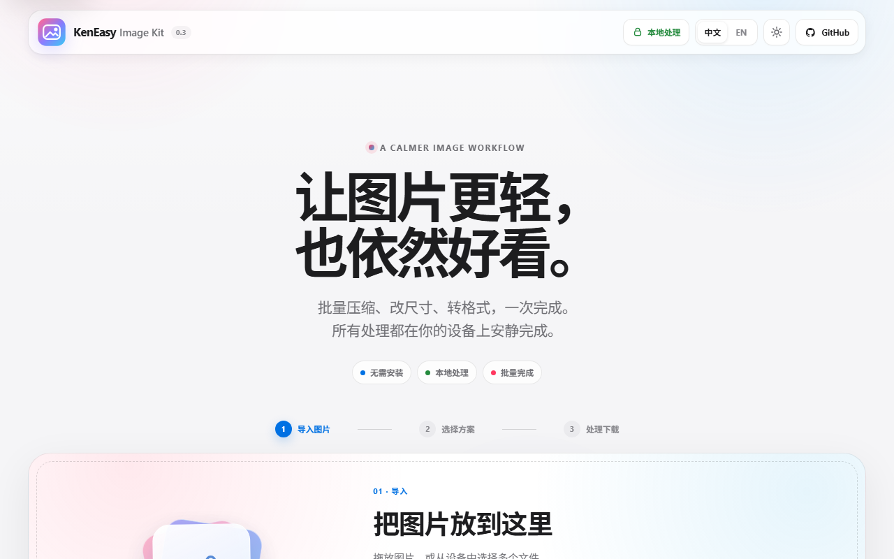
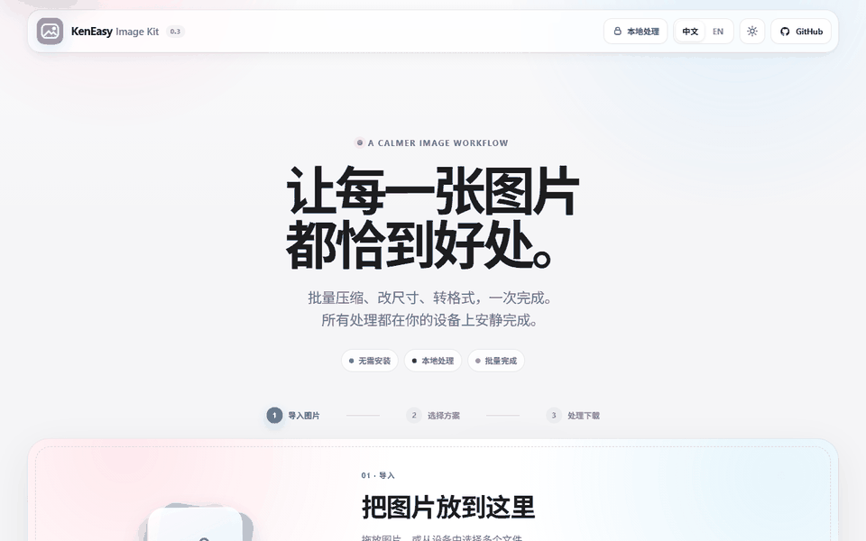
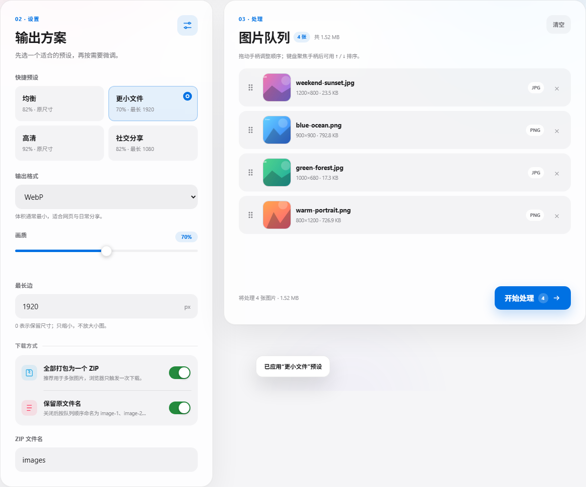
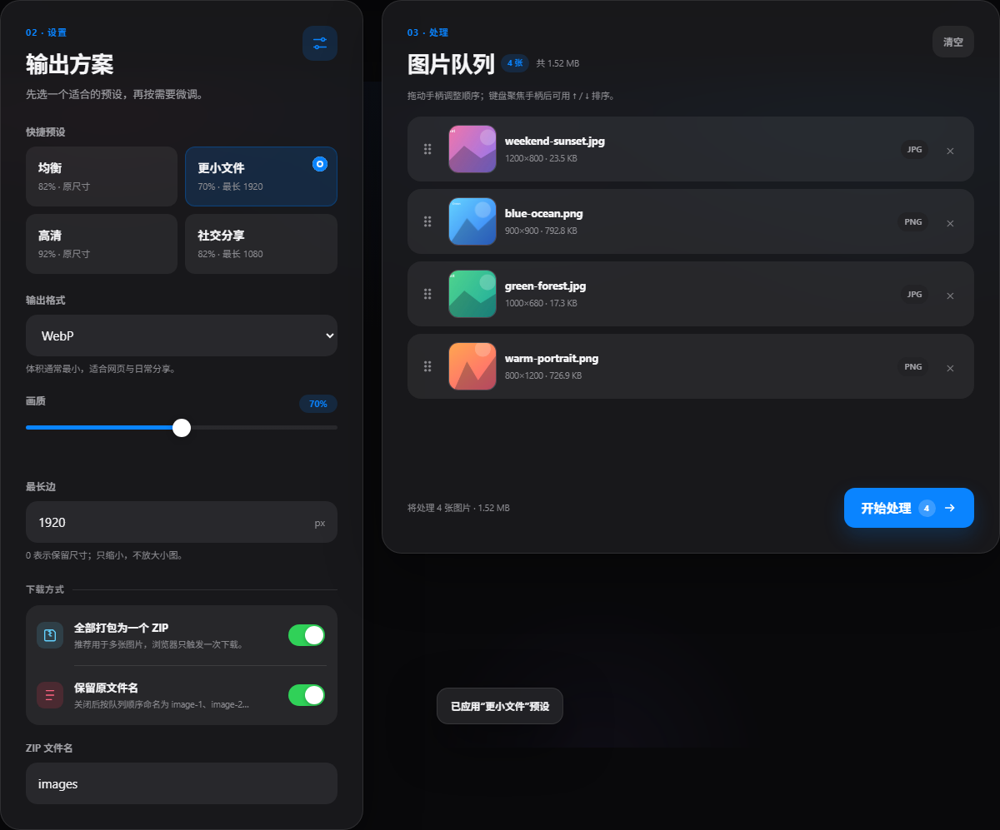
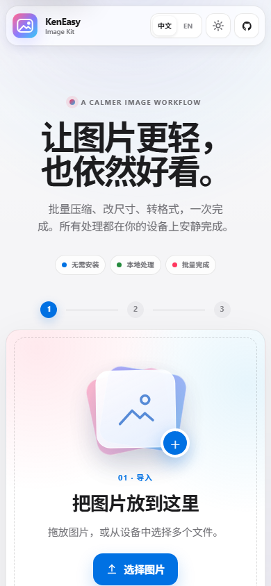

<div align="center">

# KenEasy Image Kit

**打开就能用的图片工具** — 拖入图片，压缩、改尺寸、转 WebP / JPEG / PNG，一键打包下载。
文件只在你浏览器里处理，**不上传、不安装、不注册**。

<br/>

### 👉 点这里直接使用

# [🚀 打开 Image Kit（在线）](https://ngiken.github.io/KenEasy-Image-Kit/)

**https://ngiken.github.io/KenEasy-Image-Kit/**

> 上面这个才是**工具网页**。
> 你现在看的 GitHub 页面只是**源代码**，不能当工具点着用。

<br/>

[中文](README.md) · [English](README.en.md)

<br/>


<br/><br/>

<a href="https://ngiken.github.io/KenEasy-Image-Kit/">
  
</a>

<sub>Apple-inspired 自适应界面 · 点击截图即可打开在线工具</sub>

</div>

---

## 30 秒上手

1. 打开：**[在线工具](https://ngiken.github.io/KenEasy-Image-Kit/)**
2. 把图片拖进页面（支持多选）
3. 选择「均衡 / 更小文件 / 高清 / 社交分享」预设，或手动调整格式、画质和最长边
4. 拖动 `⠿` 调整顺序；键盘用户可聚焦手柄后按 ↑ / ↓
5. 点 **开始处理** → 查看处理前后体积，再自动打包下载（或逐张下载）

就这么多。没有账号、没有安装包、没有服务器上传。

### 操作演示

<p align="center">
  
</p>

<p align="center"><strong>① 导入图片　→　② 选择方案　→　③ 本地处理并下载</strong></p>

---

## 这是什么

KenEasy Image Kit 是一个**纯前端**图片工具：

| 你想做的事 | 它怎么帮你 |
| --- | --- |
| 图片太大要压缩 | 选快捷预设，或转 WebP / JPEG 并调节画质 |
| 不懂参数怎么选 | 直接用均衡、更小文件、高清或社交分享预设 |
| 换个格式 | PNG ↔ JPEG ↔ WebP 一键互转 |
| 尺寸太大要缩小 | 设「最长边」，等比缩小（不放大小图） |
| 一堆图要打包 | 全部处理完打包成一个 zip 下载 |
| 隐私敏感图片 | 全程在本机浏览器完成，不经过服务器 |

界面支持 **中文 / English** 一键切换（右上角），会记住你的选择；首次打开按浏览器语言自动选择。

适合：发图前压体积、截图批量转格式、给网页/表单准备合规尺寸的图。

---

## 界面预览

| 浅色工作区 | 深色工作区 |
| --- | --- |
|  |  |

<p align="center">
  
</p>

<p align="center"><sub>桌面双栏、手机单栏；浅色／深色模式均会记住你的选择。</sub></p>

---

## 支持什么

| 输入格式 | 说明 |
| --- | --- |
| PNG / JPG / WEBP / GIF / BMP | 拖入或点击选择，支持多选 |

| 输出选项 | 说明 |
| --- | --- |
| 格式 | WebP / JPEG / PNG，或「尽量保持源格式」 |
| 快捷预设 | 均衡 / 更小文件 / 高清 / 社交分享，规则由配置数据驱动 |
| 画质 | 40%–100%（对 WebP / JPEG 生效；PNG 无损时自动禁用） |
| 最长边 | 像素值；`0` = 不缩放。只缩小、不放大 |
| 打包方式 | 合并成一个 zip（默认）/ 逐张下载 |
| 文件名 | zip 文件名，或保留每张原文件名（仅换扩展名） |

---

## 隐私说明

- 图片**不会上传**到任何服务器（本项目也没有后端）
- 处理只在当前浏览器标签页的内存里进行
- 关掉页面后，队列里的文件引用会被释放

---

## 本地使用（可选）

不想走在线链接时，可在本机跑同样的页面（依赖已打包在 `web/vendor/`，可离线）：

```powershell
# 在仓库根目录
python -m http.server 5173 --directory web
```

然后打开 <http://localhost:5173/>。

> 不推荐直接双击 `index.html`（`file://`），部分浏览器会限制脚本；用上面的本地服务最稳。

重新下载离线依赖（可选）：

```powershell
.\scratch\fetch-vendor.ps1
```

---

## 已知限制

- 重编码会**移除 EXIF**（含拍摄信息与方向标记）；带旋转 EXIF 的图会先按方向绘制后再输出
- GIF / BMP 选择「尽量保持源格式」且不缩放时原样保留；需要缩放时转 PNG，GIF 只输出静态帧
- 不做 HEIC 解码、水印、裁剪/旋转编辑（后续版本可能加入）
- 质量滑块对 PNG 无效（PNG 为无损）
- 单文件上限 40 MB、队列上限 120 张；输出画布还有 16,384 px / 6,400 万像素安全限制

---

## 技术与目录

纯静态站点，推送到 `main` 后由 GitHub Actions 自动发布 Pages。

| 库 | 用途 |
| --- | --- |
| SortableJS | 队列拖拽排序 |
| JSZip | 打包成 zip 下载 |
| 浏览器 Canvas | 解码 / 缩放 / 重编码（零额外依赖） |

```text
web/                 ← 网站本体（也是 Pages 发布内容）
  index.html
  styles.css
  config.js           ← 格式、限制、预设等数据规则
  i18n.js             ← 中英双语内容与翻译服务
  image-engine.js     ← 解码、缩放、编码、命名领域层
  app.js              ← 队列状态、UI 与流程编排
  vendor/            ← 离线依赖
docs/screenshots/    ← README 实机截图与动画演示
.github/workflows/   ← 自动部署
scratch/             ← 维护脚本 + 端到端测试 + 截图生成器
```

第三方许可：[`web/vendor/NOTICE.txt`](./web/vendor/NOTICE.txt)

重新生成 README 截图（维护者可选）：

```powershell
cd scratch/e2e
npm run capture:readme
```

---

## 更新说明

### v0.3.0
- 全面升级为 Apple-inspired 自适应玻璃界面：中性留白、柔和层次与克制的 KenEasy 粉蓝点缀
- 新增可记忆的浅色／深色外观切换，并跟随系统首次偏好
- 重构品牌栏、主视觉、三步工作流、导入区、设置卡片、队列与状态反馈
- 完善触控尺寸、键盘焦点、减少动态效果、语义标签和手机端无横向溢出
- 外观设计继续由语义令牌驱动，功能层与视觉层保持解耦
- 新增桌面浅色／深色、手机界面和三步动画演示，README 不再只有文字
- 端到端测试扩展到 48 项

### v0.2.0
- 重做桌面双栏工作台与移动端布局，保留 KenEasy 粉蓝暗色玻璃风格
- 新增 4 个数据驱动预设、设置记忆、队列总大小与处理前后体积摘要
- 拆分配置、国际化、图像引擎和 UI 编排层，降低耦合
- 明确 GIF/BMP 保持源格式规则，加入画布极限与输出格式校验
- 新增键盘排序、减少动态效果、高对比度适配与快速删除竞态修复
- 端到端测试扩展到 42 项，并移除每轮 30 秒的无效等待

### v0.1.0
- 首个版本：拖拽队列、排序、多图处理
- 输出 WebP / JPEG / PNG，质量滑块，最长边等比缩放
- 打包 zip 或逐张下载，可保留原文件名
- 中英双语界面，本地离线可用

---

## 链接一览

| 用途 | 链接 |
| --- | --- |
| **立即使用（推荐）** | https://ngiken.github.io/KenEasy-Image-Kit/ |
| 源代码 | https://github.com/ngiken/KenEasy-Image-Kit |

---

## 许可

[MIT](LICENSE) © 2026
